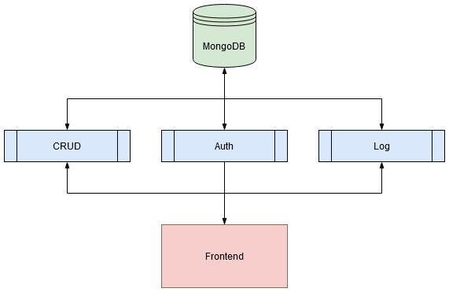

# auth-access-services


 
Sistema de autorização baseado em microsserviços. Deve automatizar as seguintes funcionalidades: 

* (1) [gerenciamento de contas de acesso](service-crud/), 

* (2) [controle de entrada e saída](service-auth/) e 

* (3) [consulta a log de acessos](service-log/)

* (+) [_frontend_](service-front/)


## Arquitetura

O sistema está distribuído em 5 contêiners docker, sendo

* Banco de dados (MongoDB)

* _Backend_ CRUD (Python)

* _Backend_ de autenticação (Python)

* _Backend_ de logs (Python)

* _Frontend_ (Angular 9)

Onde o banco de dados é acessado por todos os microsserviços de _backend_; o _backend_ de logs é acessado pelos outros dois _backends_, a fim de registrar eventos do sistema; e o _frontend_ acessa os 3 _backends_, a fim de persistir e consumir dados.




## Execução

Para executar, é necessário ter o `docker` e o `docker-compose` instalados.

Execute:

```
docker-compose up -d --build
```

## Acesso

### _Frontend_

[localhost:3000](http://localhost:3000)


### _CRUD_

[localhost:5001](http://localhost:5001)


### _Auth_

[localhost:5002](http://localhost:5002)


### _Log_

[localhost:5003](http://localhost:5003)

### _MongoDB_

[localhost:27017](localhost:27017)